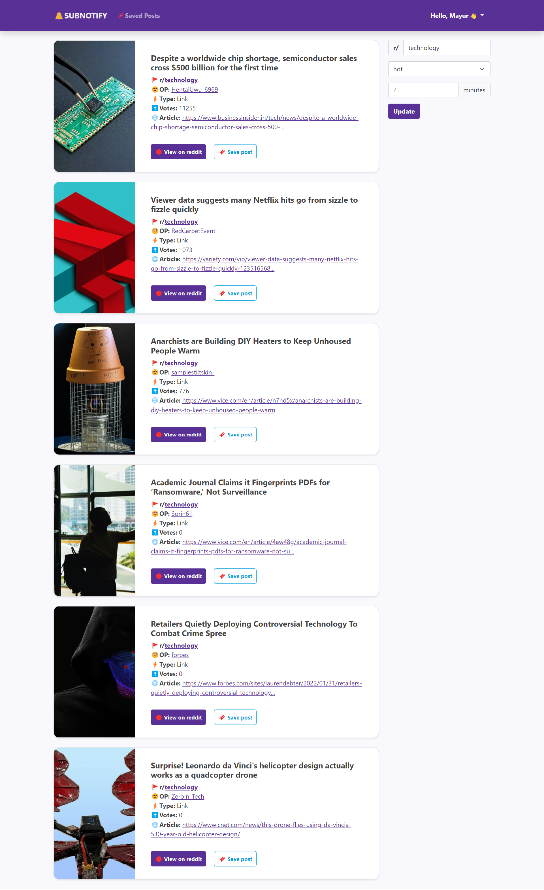

# 🔔Subreddit Notify Web App

## Description

A web app which sends latest posts of subreddit of your choice. According to the set interval, subreddit and sort type the app will keep sending the latest updates from the subreddit.

## Features

- 🕐Get periodic updates Example: every 5 minutes.
- 💁Customizable subreddit and interval time.
- 🔃 Customizable post sorting.
- 🔥Unique new posts everytime.
- 📱Fully responsive.
- 🗄️Persistent user settings.

## Demo

